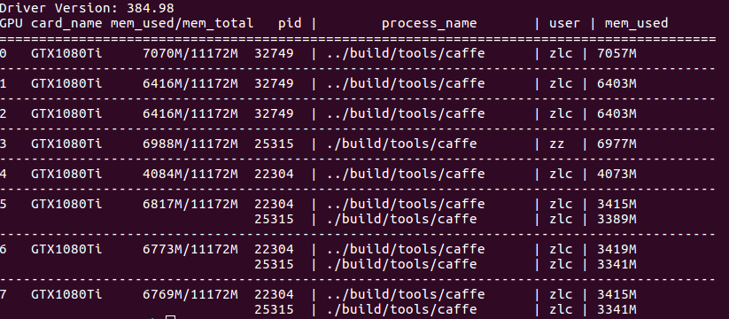

# nvlist

## What's this
An alternate to `nvidia-smi` command (on Linux systems).

It provides username of correponding process on a GPU card, and removes items such as FAN speed, etc.

It is based on `pynvml` and you can custom it yourself like me!

## Dependencies
```bash
sudo pip install nvidia-ml-py
sudo pip install psutil
```

## Installation and Usage
I would recommend copy `nvlist.py` to a path which is contained in $PATH environment variable, such as `/usr/local/bin`

```
cd /tmp
git clone https://github.com/zchrissirhcz/nvlist
chmod +x nvlist/nvlist.py
sudo cp nvlist/nvlist.py /usr/local/bin/nvlist
```

Then run:
```
nvlist
```


